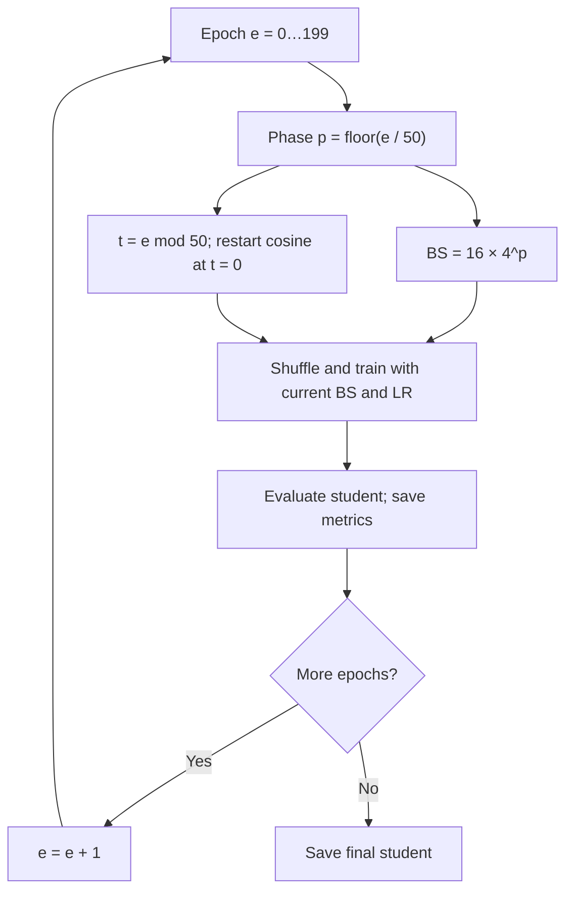

# SNKD

Data-free knowledge distillation from random synthetic images. A frozen teacher
provides soft labels for augmented random noise from nine synthetic priors. The student never trains on real images.

## Install

Requires Python 3.10+ and PyTorch; CUDA is used automatically when available.

```bash
git clone https://github.com/dexterdev/SNKD.git
cd SNKD
pip install -e '.[dev]'
```

## Model configurations

| Dataset | Teacher → student | Config |
| --- | --- | --- |
| MNIST | LeNet-5 → LeNet-5/2 | `configs/mnist.yaml` |
| Fashion-MNIST | LeNet-5 → LeNet-5/2 | `configs/fashionmnist.yaml` |
| CIFAR-10 | ResNet-34 → ResNet-18 | `configs/cifar10.yaml` |
| CIFAR-100 | ResNet-34 → ResNet-18 | `configs/cifar100.yaml` |
| CIFAR-10 | ViT-8 → ViT-4 | `configs/cifar10_vit.yaml` |
| CIFAR-100 | ViT-8 → ViT-4 | `configs/cifar100_vit.yaml` |

ViT uses the [pinned small-dataset architecture](https://github.com/lucidrains/vit-pytorch/blob/e1b08c15b9b237329d30324ce40579d4d4afc761/vit_pytorch/vit_for_small_dataset.py)
with SPT and LSA. Teacher/student depths are 8/4; both default to patch size 4,
dimension 256, 4 heads, MLP dimension 1024 and dropout 0.1.

## Run

Choose a config from the table and use it throughout:

```bash
CONFIG=configs/cifar10_vit.yaml
dfkd inspect --config "$CONFIG"
dfkd train_teacher --config "$CONFIG"
dfkd distill --config "$CONFIG"
dfkd evaluate --config "$CONFIG" --checkpoint "runs/<student-run>/best.pt"
```

Replace `runs/<student-run>/best.pt` with the actual student checkpoint path.
Datasets download to `data/` by default. Distillation requires the teacher
checkpoint at `teacher.checkpoint`; teacher training writes it automatically.

## Training settings

Defaults are in `configs/base.yaml`; dataset configs override them.
Use `--set dotted.key=value` for overrides:

```bash
dfkd train_teacher --config "$CONFIG" --epochs 200 --set teacher_training.optimizer.lr=0.05
dfkd distill --config "$CONFIG" --temperature 4 --set optimizer.lr=0.01
```

- **Teacher:** one run, up to 100 epochs by default, with a seeded 90/10
  training/validation split. Validation loss selects the best checkpoint and
  controls early stopping (patience 20, minimum improvement 0.0001; patience
  starts counting at epoch 60). Set `teacher_training.early_stopping.patience=0`
  to disable stopping. Train/validation/test loss and accuracy print each epoch;
  test metrics are reporting-only.
- **Student:** all model pairs use the augmented-noise notebook protocol below.
  Defaults are shared through `configs/base.yaml`; no architecture-specific loops.

`--epochs` controls the selected training command. Architecture options are under
`teacher.kwargs` and `student.kwargs`; supplied hyperparameters are starting defaults.

## Student algorithm and LR/BS schedule

The active code in `distillation_through_augmented_noise_CIFAR100_optimizedA100(3).ipynb`
is the protocol reference (commented-out experiments are excluded).

1. Build a fixed bank of **150,000** images: 1,500 groups of 100, choosing one of
   nine equally weighted families per group: gradient, Perlin, uniform, Gabor,
   checkerboard, pink noise, rectangular patch, closed curve, or random circles.
2. On every access, apply reflect-padded crop + horizontal flip, then **8 of 17**
   random operations without replacement, clamping after each operation.
   Teacher and student receive the **same freshly augmented, normalized view**.
3. Freeze the teacher and train the student with
   `T² × KL(softmax(teacher/T) || softmax(student/T))`, **T = 20**.
   Use SGD: LR **0.01**, momentum **0.9**, weight decay **0.0005**; shuffle each
   epoch and drop incomplete batches. Evaluate the student each epoch.

The 200-epoch schedule uses four fixed 50-epoch phases:

| Epochs (1-based) | Batch size | LR within phase |
| --- | ---: | --- |
| 1–50 | 16 | 0.01 → 0.0000001, cosine |
| 51–100 | 64 | 0.01 → 0.0000001, cosine |
| 101–150 | 256 | 0.01 → 0.0000001, cosine |
| 151–200 | 1024 | 0.01 → 0.0000001, cosine |



For `t = 0…49`, `LR = 1e-7 + (0.01 - 1e-7) × (1 + cos(πt/49))/2`.
LR is set **before** training each epoch; optimizer momentum persists across phases.
`training.phase_epochs=50` fixes phase lengths: shorter runs truncate the schedule.
Beyond 200 epochs, the final batch size persists and cosine restarts every 50 epochs.
Set `training.phase_epochs=null` to divide a custom epoch budget evenly across batch sizes.

CUDA runtime defaults use channels-last, TF32, fused SGD when available, and bf16
(or fp16 with gradient scaling); CPU uses fp32. Worker augmentation uses pinned
CUDA transfers and persistent loaders, rebuilt only when BS changes.
Set `training.runtime.num_workers=0` for debugging or `training.runtime.precision=fp32`
to disable autocast. The float32 CIFAR bank needs about **1.72 GiB RAM**;
`synthetic_data.materialize=false` regenerates the same indexed images to save RAM.

Adaptations: priors support the dataset's image size/channel count, MNIST disables
flips, and grayscale jitter omits hue/saturation. Seeds reproduce the corpus but
not the notebook's exact random sequence. Geometry and random-operation switches
are independent (correcting the notebook's indentation). KL is computed in fp32
for numerical stability. Console output stays concise; CSV records LR, BS, KD
loss, test loss/accuracy, teacher agreement and query counts. KD loss is sample-weighted;
the notebook's unweighted batch mean is equivalent with the default drop-last batches.

## Outputs

Runs are saved under `runs/<name>_<timestamp>/`.

| Run | Files |
| --- | --- |
| Teacher | `config.yaml`, `split.pt`, `metrics.csv`, `metrics.jsonl`, `results.json`, `best.pt`; best weights also exported to `teacher.checkpoint` |
| Student | `config.yaml`, `metrics.csv`, `results.json`, `best.pt`, `last.pt` |

Teacher files retain detailed classification, calibration and timing metrics;
JSONL includes per-class scores and confusion matrices. Accuracy is in percent;
precision/recall/F1 and calibration error are fractions.

## Tests and license

`pytest -q` runs CPU tests using artificial data, without dataset downloads.

MIT. The vendored ViT source retains Phil Wang's MIT license.
